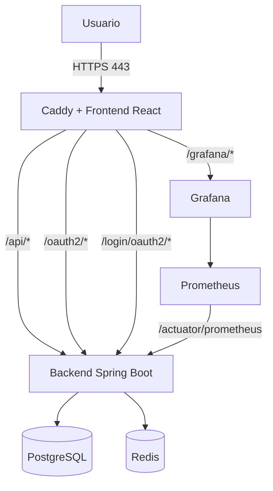

# DEPLOY.md - CorpusLab

Guía detallada del proceso de despliegue en entornos de producción utilizando una arquitectura contenerizada.

Para garantizar la máxima seguridad, portabilidad y rendimiento, el sistema se orquesta íntegramente mediante Docker Compose. Como proxy inverso y servidor web se utiliza Caddy, el cual simplifica la gestión de red sirviendo los estáticos de React, enrutando el tráfico de la API (Spring Boot) y aprovisionando automáticamente certificados HTTPS (TLS).

## 1. 🚀 Arquitectura

El siguiente diagrama muestra el flujo de peticiones y la arquitectura del sistema:



Servicios levantados:

| Servicio     | Descripción                |
| ------------ | -------------------------- |
| `frontend`   | React compilado + Caddy.   |
| `backend`    | API Spring Boot.           |
| `postgres`   | Base de datos.             |
| `redis`      | Caché.                     |
| `prometheus` | Métricas.                  |
| `grafana`    | Paneles de monitorización. |

## 2. 📋 Prerrequisitos

Servidor recomendado:

- CPU: 2 vCPU mínimo.
- Memoria: 4 GB RAM mínimo.
- ALmacenamiento: 30 GB libres mínimo.

Software necesario:

- Docker Engine `20.10+`.
- Docker Compose v2 `2.0+`.
- Internet para descargar imágenes y emitir certificados HTTPS.
- Dominio válido apuntando al servidor, por ejemplo `corpuslab.fic.udc.es`.
- Puertos `80` y `443` abiertos.

Comprobación:

```bash
docker --version
docker compose version
```

## 3. ⚙️ Configuración del Entorno

Primero descarga el repositorio:

```bash
sudo mkdir -p /opt/corpuslab
sudo chown "$USER":"$USER" /opt/corpuslab
git clone https://github.com/mateoaguirrecancela/CorpusLab.git /opt/corpuslab
cd /opt/corpuslab
```

Crea el archivo `.env` desde la plantilla:

```bash
cp .env.example .env
chmod 600 .env
nano .env
```

Variables importantes:

| Variable                             | Uso                                               |
| ------------------------------------ | ------------------------------------------------- |
| `DOMAIN_NAME`                        | Dominio del servidor.                             |
| `POSTGRES_DB`                        | Nombre de la base de datos.                       |
| `POSTGRES_USER`                      | Usuario de PostgreSQL.                            |
| `POSTGRES_PASSWORD`                  | Contraseña de PostgreSQL.                         |
| `JWT_SECRET`                         | Secreto para firmar tokens.                       |
| `JPA_DDL_AUTO`                       | Estrategia de esquema de Hibernate.               |
| `GRAFANA_ADMIN_USER`                 | Usuario de Grafana.                               |
| `GRAFANA_ADMIN_PASSWORD`             | Contraseña de Grafana.                            |
| `MAIL_*`                             | Configuración SMTP.                               |
| `GOOGLE_CLIENT_*`, `GITHUB_CLIENT_*` | Credenciales OAuth2, si se usan esos proveedores. |

> [!NOTE]
> `JPA_DDL_AUTO=validate` es la opcion recomendada en produccion, siempre que la base de datos ya tenga el esquema creado. Para un primer despliegue sin migraciones se puede usar temporalmente `update`, revisar el arranque y volver a `validate`.

Si se configura OAuth2, registra en los proveedores las siguientes URLs de callback:

```text
https://dominio/login/oauth2/code/google
https://dominio/login/oauth2/code/github
```

Genera secretos seguros:

```bash
openssl rand -base64 32
openssl rand -base64 64
```

> [!WARNING]
> No subas nunca `.env` al repositorio y cambia siempre los valores por defecto.

## 4. 🛠️ Despliegue

Compilar y arrancar todo:

```bash
docker compose up -d --build
```

Verificar contenedores:

```bash
docker compose ps
```

Comprobar logs si algo falla:

```bash
docker compose logs -f --tail=100
```

## 5. 🔌 Acceso

Con `DOMAIN_NAME=corpuslab.fic.udc.es`:

- Frontend: `https://corpuslab.fic.udc.es/`
- API REST: `https://corpuslab.fic.udc.es/api/`
- Grafana: `https://corpuslab.fic.udc.es/grafana/`

## 6. 💾 Persistencia y Logs

Volúmenes persistentes:

- `postgres-data`: datos de PostgreSQL.
- `redis-data`: datos de Redis.
- `grafana-data`: datos de Grafana.
- `prometheus-data`: métricas de Prometheus.
- `caddy-data`: certificados HTTPS de Caddy.
- `caddy-config`: configuración interna de Caddy.

Logs generales:

```bash
docker compose logs -f --tail=100
```

Logs por servicio:

```bash
docker compose logs -f --tail=100 backend
docker compose logs -f --tail=100 frontend
docker compose logs -f --tail=100 postgres
docker compose logs -f --tail=100 grafana
```

> [!IMPORTANT]
> `docker compose down` no borra volúmenes. No uses `docker compose down -v` salvo que quieras eliminar datos persistentes.
