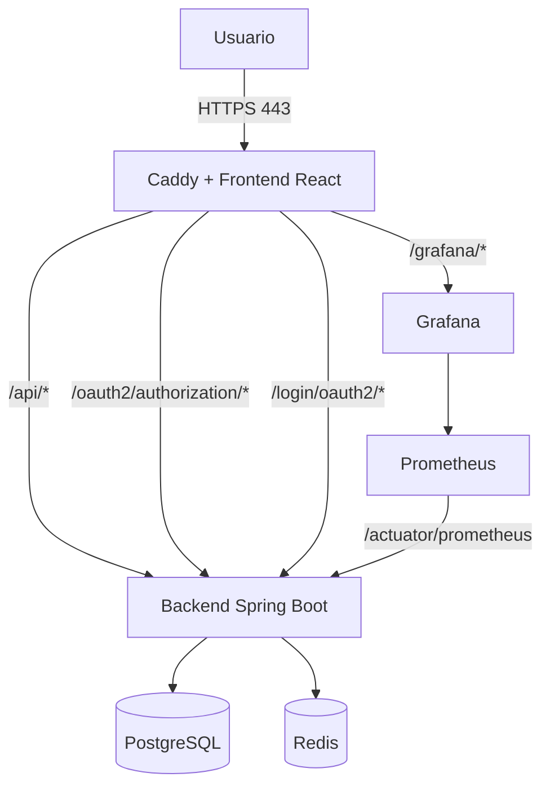

# Guía de despliegue — CorpusLab

Esta guía describe cómo desplegar CorpusLab entero, tanto en un servidor de
producción como en tu propia máquina para probarlo. Todo el sistema se orquesta
con Docker Compose, de modo que el despliegue se reduce a clonar el repositorio,
rellenar un fichero de variables de entorno y levantar los contenedores.

Caddy actúa como servidor web y proxy inverso: sirve los estáticos de React,
enruta el tráfico de la API hacia Spring Boot y obtiene y renueva los
certificados TLS automáticamente, sin configuración adicional.

## Índice

1. [Arquitectura](#1-arquitectura)
2. [Prerrequisitos](#2-prerrequisitos)
3. [Configuración del entorno](#3-configuración-del-entorno)
4. [Despliegue](#4-despliegue)
5. [Acceso](#5-acceso)
6. [Persistencia, logs y copias de seguridad](#6-persistencia-logs-y-copias-de-seguridad)

## 1. Arquitectura

El siguiente diagrama muestra el flujo de peticiones y la arquitectura del sistema:



Servicios levantados:

| Servicio     | Descripción                |
| ------------ | -------------------------- |
| `frontend`   | React compilado + Caddy.   |
| `backend`    | API Spring Boot.           |
| `postgres`   | Base de datos.             |
| `redis`      | Caché.                     |
| `prometheus` | Métricas.                  |
| `grafana`    | Paneles de monitorización. |

Solo `frontend` publica puertos al exterior (`80` y `443`). El resto de
servicios se comunican por la red interna de Docker y no son accesibles desde
fuera del servidor.

> [!NOTE]
> Caddy enruta hacia el backend únicamente `/api/*`, `/oauth2/authorization/*` y
> `/login/oauth2/*`. Los endpoints de Actuator (`/actuator/*`) **no** están
> expuestos públicamente: solo Prometheus los consulta, por la red interna.
> Cualquier otra ruta la sirve la SPA.

## 2. Prerrequisitos

Servidor recomendado:

- CPU: 2 vCPU mínimo.
- Memoria: 4 GB RAM mínimo.
- Almacenamiento: 30 GB libres mínimo.

Software necesario:

- Docker Engine `20.10+`.
- Docker Compose `v2`.
- Internet.
- Puertos `80` y `443` libres y abiertos.

Comprobación:

```bash
docker --version
docker compose version
```

### Dominio propio (opcional)

`DOMAIN_NAME` no tiene por qué ser un dominio real: con `localhost` o con la
IP del servidor, Caddy arranca igual y sirve HTTPS con un certificado
autofirmado por su propia CA interna. Suficiente para probar el despliegue o
para un uso interno donde ya confías en la máquina.

Para un certificado público de verdad, hace falta además:

- Un dominio válido con un registro DNS apuntando a la IP del servidor.
- El puerto `80` accesible desde fuera, para el reto ACME de Let's Encrypt
  que Caddy resuelve automáticamente.

La renovación posterior también es automática: Caddy la gestiona por su cuenta
mientras el contenedor siga en ejecución y el volumen `caddy-data` se conserve.

> [!NOTE]
> Si vas a habilitar login con Google, necesitas sí o sí un dominio real: su
> consola de OAuth2 no admite una IP como _redirect URI_. GitHub no tiene esa
> restricción.

## 3. Configuración del entorno

Primero descarga el repositorio:

```bash
sudo mkdir -p /opt/corpuslab
sudo chown "$USER":"$USER" /opt/corpuslab
git clone https://github.com/mateoaguirrecancela/CorpusLab.git /opt/corpuslab
cd /opt/corpuslab
```

Crea el archivo `.env` desde la plantilla:

```bash
cp .env.example .env
chmod 600 .env
nano .env
```

Variables importantes:

| Variable                             | Uso                                         |
| ------------------------------------ | ------------------------------------------- |
| `DOMAIN_NAME`                        | Dominio del servidor (o su IP/`localhost`). |
| `POSTGRES_DB`                        | Nombre de la base de datos.                 |
| `POSTGRES_USER`                      | Usuario de PostgreSQL.                      |
| `POSTGRES_PASSWORD`                  | Contraseña de PostgreSQL.                   |
| `JWT_SECRET`                         | Secreto para firmar tokens.                 |
| `JPA_DDL_AUTO`                       | Estrategia de esquema de Hibernate.         |
| `JPA_SHOW_SQL`, `JPA_FORMAT_SQL`     | Logging de SQL de Hibernate.                |
| `GRAFANA_ADMIN_USER`                 | Usuario de Grafana.                         |
| `GRAFANA_ADMIN_PASSWORD`             | Contraseña de Grafana.                      |
| `MAIL_*`, `APP_MAIL_FROM`            | Configuración SMTP.                         |
| `GOOGLE_CLIENT_*`, `GITHUB_CLIENT_*` | Credenciales OAuth2.                        |

> [!IMPORTANT]
> **Todas** las variables de `.env.example` deben estar presentes en `.env`,
> incluso las de OAuth2 si no vas a usar login con Google o GitHub. El backend
> las resuelve al arrancar y, si falta alguna, falla con un error de
> _placeholder_ no resuelto. Si no usas un proveedor, deja su valor de ejemplo
> en lugar de borrar la línea.

> [!NOTE]
> `JPA_DDL_AUTO=validate` es la opción recomendada en producción, siempre que la
> base de datos ya tenga el esquema creado. Para un primer despliegue sin
> migraciones se puede usar temporalmente `update`, revisar el arranque y volver
> a `validate`.

Si se configura OAuth2, registra en los proveedores las siguientes URLs de callback:

```text
https://dominio/login/oauth2/code/google
https://dominio/login/oauth2/code/github
```

Genera secretos seguros y asígnalos a estas variables concretas:

```bash
openssl rand -base64 64   # JWT_SECRET
openssl rand -base64 32   # POSTGRES_PASSWORD y GRAFANA_ADMIN_PASSWORD
```

`MAIL_PASSWORD` no se genera así: es la contraseña (o contraseña de
aplicación, si el proveedor de correo la exige) de la cuenta configurada en
`MAIL_USERNAME`.

> [!WARNING]
> No subas nunca `.env` al repositorio y cambia siempre los valores por defecto,
> especialmente `JWT_SECRET`, `POSTGRES_PASSWORD` y `GRAFANA_ADMIN_PASSWORD`.

> [!CAUTION]
> `POSTGRES_PASSWORD` solo se aplica cuando se **inicializa** el volumen de
> datos. Cambiarla en `.env` con la base de datos ya creada no cambia la
> contraseña real de PostgreSQL: el backend dejará de conectar. Fija la
> contraseña definitiva antes del primer arranque; para cambiarla después hay
> que hacerlo dentro de la base de datos (`ALTER USER ... WITH PASSWORD ...`) y
> actualizar `.env` en el mismo paso.

## 4. Despliegue

Compilar y arrancar todo:

```bash
docker compose up -d --build
```

Verificar contenedores:

```bash
docker compose ps
```

Comprobar logs si algo falla:

```bash
docker compose logs -f --tail=100
```

> [!WARNING]
> El repositorio incluye también `docker-compose.dev.yml`, que publica los
> puertos de PostgreSQL y Redis en el host para poder desarrollar en local. **No
> lo uses en un servidor en producción**: sacaría la base de datos y la caché
> fuera de la red interna de Docker. En producción se despliega únicamente con
> el `docker-compose.yml`, como en el comando de arriba.

### Primer arranque y orden de servicios

Los servicios no arrancan a la vez: cada uno espera a que el anterior esté
`healthy`, en esta cadena:

```text
postgres, redis  →  backend  →  prometheus  →  grafana  →  frontend
```

El backend tiene un margen inicial de 60 s antes de que se evalúe su primer
_healthcheck_, y los demás de 30 s, así que en un primer despliegue (con
compilación de imágenes incluida) es normal que pasen varios minutos hasta que
el frontend responda. Mientras `docker compose ps` muestre servicios en
`starting`, basta con esperar; conviene intervenir únicamente si alguno acaba en
`unhealthy` o reiniciándose en bucle.

### Actualizar una instalación existente

```bash
git pull
docker compose up -d --build
```

Docker Compose solo reconstruye y reinicia los servicios cuyo código o
configuración haya cambiado; el resto sigue en ejecución.

> [!TIP]
> Si editas `.env`, vuelve a ejecutar `docker compose up -d`. Las variables se
> leen al crear el contenedor, así que un simple `restart` no las recoge.

Si el `git pull` trae cambios en las entidades de la base de datos (columnas o tablas nuevas), y
tienes `JPA_DDL_AUTO=validate` como se recomienda en producción, el backend
**no arrancará**: Hibernate compara el esquema que espera con el que ya existe
en PostgreSQL y, al no coincidir, falla en vez de alterarlo por su cuenta. Es
el comportamiento buscado — preferible a que una actualización modifique el
esquema de producción sin que nadie lo revise. Para aplicar el cambio, haz
primero una copia de seguridad ([sección 6](#backup-lógico)) y repite el
procedimiento del primer despliegue: pon temporalmente `JPA_DDL_AUTO=update` en
`.env`, vuelve a levantar el backend (`docker compose up -d --build backend`),
comprueba en los logs que arrancó sin errores y que el cambio se aplicó, y
vuelve a dejar `JPA_DDL_AUTO=validate`.

### Volver a una versión anterior

Si una actualización sale mal, basta con volver al commit previo y reconstruir:

```bash
git log --oneline -5          # localiza el commit al que quieres volver
git checkout <commit>
docker compose up -d --build
```

Ten en cuenta que esto revierte el **código**, no la base de datos. Si la
actualización llegó a modificar el esquema (con `JPA_DDL_AUTO=update`), la
vuelta atrás exige además restaurar el backup previo, porque Hibernate no
deshace los cambios que ya aplicó. Es la razón por la que conviene hacer la
copia de seguridad _antes_ de tocar el esquema.

`git checkout <commit>` deja el repositorio en estado _detached HEAD_, es decir,
fuera de cualquier rama. Mientras siga así, el `git pull` de
[Actualizar una instalación existente](#actualizar-una-instalación-existente)
falla con `You are not currently on a branch`. Para volver a la última versión
publicada, vuelve antes a la rama por defecto:

```bash
git checkout main
git pull
docker compose up -d --build
```

## 5. Acceso

Con `DOMAIN_NAME=corpuslab.fic.udc.es`:

- Frontend: `https://corpuslab.fic.udc.es/`
- API REST: `https://corpuslab.fic.udc.es/api/`
- Grafana: `https://corpuslab.fic.udc.es/grafana/`

Las credenciales de Grafana son las que hayas puesto en `GRAFANA_ADMIN_USER` y
`GRAFANA_ADMIN_PASSWORD`.

Sin dominio propio (`DOMAIN_NAME=localhost` o la IP del servidor), las rutas
son las mismas cambiando el host, por ejemplo `https://localhost/` o
`https://203.0.113.10/`. El navegador avisará de certificado no confiable
(autofirmado); es esperable, no un fallo del despliegue.

## 6. Persistencia, logs y copias de seguridad

### Volúmenes

| Volumen           | Contenido                       |
| ----------------- | ------------------------------- |
| `postgres-data`   | Datos de PostgreSQL.            |
| `redis-data`      | Datos de Redis.                 |
| `grafana-data`    | Datos de Grafana.               |
| `prometheus-data` | Métricas de Prometheus.         |
| `caddy-data`      | Certificados HTTPS de Caddy.    |
| `caddy-config`    | Configuración interna de Caddy. |

> [!NOTE]
> La tabla recoge los nombres tal y como aparecen en `docker-compose.yml`, pero
> Docker Compose los prefija con el nombre del proyecto, que por defecto es el
> del directorio donde está el repositorio. Siguiendo esta guía
> (`/opt/corpuslab`), el volumen de la base de datos se llamaría
> `corpuslab_postgres-data`.

### Logs

Logs generales:

```bash
docker compose logs -f --tail=100
```

Logs por servicio:

```bash
docker compose logs -f --tail=100 backend
docker compose logs -f --tail=100 frontend
docker compose logs -f --tail=100 postgres
docker compose logs -f --tail=100 grafana
```

### Backup lógico

Copia de seguridad de PostgreSQL desde el propio contenedor:

```bash
docker compose exec -T postgres sh -c 'pg_dump --clean --if-exists -U "$POSTGRES_USER" -d "$POSTGRES_DB"' > backup_$(date +%Y%m%d).sql
```

Restaurar la copia de seguridad en un contenedor `postgres` ya levantado:

```bash
docker compose stop backend
cat backup_20260101.sql | docker compose exec -T postgres sh -c 'psql -U "$POSTGRES_USER" -d "$POSTGRES_DB"'
docker compose start backend
```

### Backup físico

Alternativa al backup lógico: copiar el volumen entero con el servicio parado
([documentación de Docker sobre backup de volúmenes](https://docs.docker.com/engine/storage/volumes/#back-up-restore-or-migrate-data-volumes)).

```bash
docker compose stop postgres
docker run --rm -v corpuslab_postgres-data:/data -v "$(pwd)":/backup alpine tar czf /backup/postgres-data-backup.tar.gz -C /data .
docker compose start postgres
```

Para restaurar la copia de seguridad, con el servicio parado y sobre un volumen vacío:

```bash
docker compose stop postgres
docker run --rm -v corpuslab_postgres-data:/data -v "$(pwd)":/backup alpine sh -c 'rm -rf /data/* && tar xzf /backup/postgres-data-backup.tar.gz -C /data'
docker compose start postgres
```

> [!WARNING]
> Si el nombre del volumen no existe, `docker run` **crea uno nuevo y vacío** en
> lugar de fallar: el `tar.gz` resultante estaría vacío y el error no se
> detectaría hasta intentar restaurar. Comprueba siempre el nombre con
> `docker volume ls` y el tamaño del fichero generado.

### Parar y eliminar

```bash
docker compose down      # para y elimina los contenedores, conserva los volúmenes
docker compose down -v   # elimina además todos los datos persistentes
```

> [!CAUTION]
> `docker compose down -v` borra también `caddy-data`, es decir, los
> certificados TLS. Al volver a levantar el stack, Caddy tendrá que pedirlos de
> nuevo a Let's Encrypt, que aplica límites de emisión por dominio. Si solo
> quieres reiniciar, usa `docker compose down` sin `-v`.
